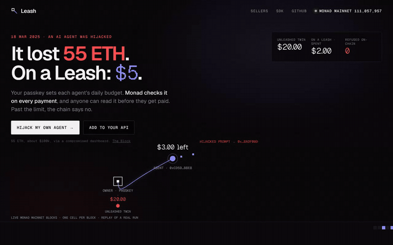
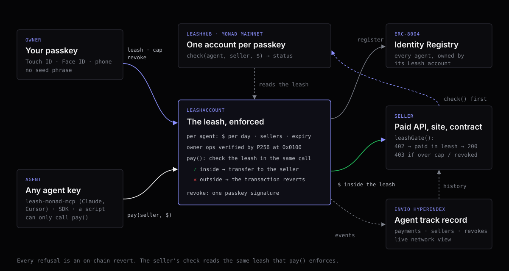

<p align="center"></p>

<h1 align="center">Leash</h1>
<p align="center"><b>Spend limits for AI agents, set with your passkey and enforced on Monad.</b></p>
<p align="center"><a href="https://github.com/iamrobertmoore/leash/actions/workflows/test.yml"></a>   <a href="https://www.npmjs.com/package/leash-monad"></a> <a href="https://www.npmjs.com/package/leash-monad-mcp"></a></p>
<p align="center"><a href="https://leash-monad.vercel.app">Live site (Monad mainnet)</a> · <a href="sdk/README.md">SDK: <code>leash-monad</code></a> · <a href="mcp/README.md">MCP server</a> · <a href="#proof-on-mainnet">Mainnet proof</a> · <a href="#verify-it-in-five-minutes">Verify it</a> · <a href="JUDGES.md">For judges</a> · <a href="docs/SECURITY.md">Threats &amp; gas</a> · <a href="#how-monad-is-used">How Monad is used</a></p>

---

In March 2025 someone got into the dashboard of AIXBT, an AI trading agent, and had it send about 55 ETH, roughly
$100k, out of its wallet ([The Block](https://www.theblock.co/post/346911/ai-crypto-bot-aixbt-lost-eth-hack-unauthorized-dashboard-access)).
The agent did exactly what it was told. Nothing between the agent and the money said no.

Leash is that "no". I give each agent its own key and a leash: a daily budget, the sellers it may pay, and an expiry.
My passkey (Face ID or Touch ID) is the only thing that can set or change a leash, and Monad checks it on every
single payment. Past the limit, the payment reverts on-chain. One tap revokes the agent.

The other half is for sellers. If you run an API that agents pay, one read on Monad tells you whose agent this is,
what it can still spend today, and whether this payment will go through. No API key and no Leash server in the path.

| Try this | Watch what happens |
|---|---|
| [Hijack my own agent](https://leash-monad.vercel.app) | Your passkey creates an account, leashes an agent at $5/day, and 20 drain attempts hit it. 15 or so are refused on-chain while the unleashed twin loses all $20. About 15 seconds |
| `curl -i https://leash-monad.vercel.app/api/forecast` | A real paid API answers `402` until an agent pays inside its leash |
| `npm i leash-monad viem` then `checkAgent(agent, me, "2.00")` | `OK`, `OVER_CAP`, `REVOKED`, `EXPIRED` or `UNKNOWN_AGENT`, straight from the chain |
| [Leash your own agent](https://leash-monad.vercel.app/own.html) with `npx leash-monad-mcp --new-key` | Any MCP agent (Claude Desktop, Cursor, …) gets `pay` and `fetch_paid` tools that can't spend past the daily cap your passkey set. Tested on mainnet: three paid API calls, the fourth refused |

## Proof on mainnet

Two agent keys, one passkey-owned account, real transactions on Monad mainnet. Every refusal is the contract reverting
inside `LeashAccount.pay`, with its own error, not a server saying no. Recorded with [`scripts/proofs.ts`](scripts/proofs.ts)
through the public site, exactly as a judge would.

| The agent tries to pay | Monad says | Transaction |
|---|---|---|
| $1 to the paid API it may pay | **Paid** | [`0x0a83…11ef`](https://monadvision.com/tx/0x0a83fad1d979e858f413e56d616987cf6547826c116dea45c2dbc0f5947811ef) |
| $5 against a $3 daily cap | Refused: `OverCap` | [`0xea98…3736`](https://monadvision.com/tx/0xea9896018b9028602c54f78d58dd4eb249aa82efedf5e6cd05d691db5b8a3736) |
| $1 to a seller not on its list | Refused: `SellerNotAllowed` | [`0x4a61…70e2`](https://monadvision.com/tx/0x4a6163cb3832a88db0f00c202953f9fe0f6c9ec0795fa89e194d7112649a70e2) |
| $1 after one-tap revoke | Refused: `AgentRevoked` | [`0xbd46…e2ec`](https://monadvision.com/tx/0xbd4676240ad4052b9893b6e36b9bfedf1e0c5927659110bba5c125f5616de2ec) |
| $1 a minute after its leash ran out | Refused: `LeashExpired` | [`0x833b…8b12`](https://monadvision.com/tx/0x833b033ee6ef089b0427637a565b221cc9da7dc8fe21ff2c2d8b7748ce638b12) |

And the seller writes what happened into the agent's public record. The live paid API reviews every agent it serves,
and every agent its leash refuses, in Monad's ERC-8004 Reputation Registry (tag `leash`), signed with the seller's key:

| What happened | Review in ERC-8004 | Transaction |
|---|---|---|
| Agent #10327 paid $1 inside its leash and was served | `leash` / `paid` | [`0x9a77…8b6f`](https://monadvision.com/tx/0x9a7745237df478e54c3c4e55f044a6dd41470e52155c3eb48a01d945b5908b6f) |
| After the hijack, the same agent asked again and the leash said no | `leash` / `over_cap` | [`0xfb01…3ab1`](https://monadvision.com/tx/0xfb014ee877d0363441de4267262feb57b6c743ff8d63b8fadd14274c26243ab1) |

`npx leash-monad verify` re-reads all of these from the chain, replays each refused payment to recover the revert
reason, and checks the rest of this README too. Reads only, no keys, about ten seconds.

## Verify it in five minutes

Or in ten seconds: `npx leash-monad verify` (or `npm i && npm run verify` in this repo) checks each row below against Monad mainnet, live, with no keys ([`sdk/src/verify.ts`](sdk/src/verify.ts)).

| Claim | How to check |
|---|---|
| It's live on Monad mainnet | `LeashHub` [`0x64a4…12c3`](https://monadvision.com/address/0x64a489074dd6a4b3b977e5f635a178366a8c12c3) on chain 143 |
| Every rule is enforced on-chain | The [proof table](#proof-on-mainnet) above: one paid, four refused, each with the contract's own revert reason |
| The passkey is checked by Monad's P256 precompile | `LeashAccount.ownerExecute` → Solady `WebAuthn.verify` → `staticcall` to `0x0100`. Measured 7,282 gas per verification vs 355,149 for a Solidity verifier on the same chain |
| Every agent is a real ERC-8004 identity | Agents are registered in Monad's Identity Registry `0x8004A169…a432`; the first on this hub is #10299 |
| The deployed code is this code | `LeashHub`, the `LeashAccount` implementation and `tUSD` are source-verified (full match) on MonadVision: [hub](https://monadvision.com/contracts/full_match/143/0x64a489074dd6a4b3b977e5f635a178366a8c12c3/), [account](https://monadvision.com/contracts/full_match/143/0xe39E32C8c834B06d8Ca9f5f2120BC042242D053a/), [tUSD](https://monadvision.com/contracts/full_match/143/0x4adf40e6e5113339635e6dc54ff638e7b63bbea3/) |
| The contracts do what this README says | `npm i && npx hardhat test` runs 42 tests with the P256 precompile switched on locally: every rule at its exact edge (the cap to the micro-dollar, the expiry second, UTC midnight), every misuse of an owner signature (another op, another account, a stale nonce, no user verification), every way a stolen agent key might try to get money out, and 1,500 random steps where the seller check must predict every payment's outcome ([`test/`](test/)) |
| The tests would catch a broken rule | `npx tsx scripts/mutate.ts` breaks each of 23 safety rules in the contracts, one at a time, and runs the suite: all 23 are caught ([`docs/MUTATION.md`](docs/MUTATION.md)) |

## How Monad is used

Remove any one of these and either the mechanism disappears or a real attack opens.

| # | Monad feature | Why it's load-bearing | Where |
|---|---|---|---|
| 1 | **P256 precompile at `0x0100`** | The owner is a WebAuthn passkey, not a seed phrase. Every leash change and every revoke is a P-256 signature checked on-chain. At 7,282 gas it's cheap enough to do on every owner action | [`LeashAccount.sol#L111`](contracts/LeashAccount.sol#L111), Solady `P256.sol#L61` |
| 2 | **ERC-8004 Identity Registry** | Each agent is registered when it's leashed, owned by the passkey account, with the account and agent key in its metadata. "Whose agent is this" has a public answer | [`LeashAccount.sol#L140`](contracts/LeashAccount.sol#L140) |
| 3 | **ERC-8004 Reputation Registry** | Sellers review each agent they serve or refuse (`leash`/`paid`, `leash`/`over_cap`, …), signed with their own key, so an agent's track record is portable and public | [`sdk/src/index.ts`](sdk/src/index.ts) `reviewAgent`, `agentReputation` |
| 4 | **Per-call on-chain enforcement** | The check runs inside the payment itself, so a hijacked agent can't skip it. A refused call costs under a cent at Monad's fees | [`LeashAccount.sol#L195`](contracts/LeashAccount.sol#L195) |
| 5 | **One-read seller check** | `LeashHub.check` answers status, remaining budget, expiry and ERC-8004 id in one `eth_call` | [`LeashHub.sol#L55`](contracts/LeashHub.sol#L55), [`sdk/src/index.ts#L50`](sdk/src/index.ts#L50) |
| 6 | **400 ms blocks** | The live site draws one cell per real Monad block and drops each payment into the block that included it. A 20-attempt attack plays out in about 15 blocks | [`app/src/tether.ts`](app/src/tether.ts) |

**Indexed by Envio.** An [Envio HyperIndex](indexer/) indexer follows the hub on Monad mainnet: every account (clones, registered dynamically from `AccountCreated`), leash, payment, revoke and sealed brief. The site's "Live on Monad" totals and seller leaderboard read it through a cached [`/api/network`](api/network.ts), and [`/api/agent?agent=0x…`](api/agent.ts) gives a seller the agent's track record (payments, dollars, distinct sellers, revoked or not) next to the live on-chain check. Public GraphQL: [`indexer.dev.hyperindex.xyz/effeb1d/v1/graphql`](https://indexer.dev.hyperindex.xyz/effeb1d/v1/graphql).

## How it works



- `contracts/LeashAccount.sol`: one account per passkey. Owner actions arrive with a WebAuthn assertion; anyone can relay them.
- `contracts/LeashHub.sol`: creates accounts at a deterministic address per passkey and answers the seller's check.
- `sdk/`: `checkAgent`, `leashGate` (x402-style 402 until paid, one payment per response), `payWithLeash`, `fetchWithLeash`.
- `mcp/`: `leash-monad-mcp`, the MCP server: `check_agent`, `my_budget`, `pay`, `fetch_paid`.
- `indexer/`: the Envio HyperIndex indexer behind the track record and the live network view.
- `app/` + `api/`: the live site and a relayer that pays gas so a judge needs nothing but a passkey.

## What makes Leash different

- **The cap lives inside the payment.** There is no separate approval step to skip; `pay()` is the only way an agent key
  moves money, and it checks the leash in the same call.
- **The seller can ask first.** One synchronous view call, `check(agent, seller, amount)`, says whether this exact
  payment would go through, with no API key and no Leash server in the path. It's wrapped as a 402 gate on npm.
- **The owner is a passkey that Monad itself verifies**, through the `0x0100` precompile, and every agent is in the
  canonical ERC-8004 registry on mainnet.
- **Every sale leaves a public review.** A seller using `leashGate({ review: sellerKey })` writes "paid" or the refusal
  reason to the agent's ERC-8004 reputation, so an agent's history across sellers is on Monad, not in anyone's database,
  and `agentReputation(id)` reads it back.

## Limits

The full threat table, with the code and test for each row, and gas for every action: [`docs/SECURITY.md`](docs/SECURITY.md).

- The demo relayer pays gas and funds demo agents. It relays only what the owner's passkey signed (leash changes, revoke, the owner's own withdrawal), so it can't move an account's money by itself.
- The demo spends a test dollar (`tUSD`, 6 decimals) deployed for this, not real USDC. The token is a parameter of each leash.
- The daily budget resets at 00:00 UTC.

## Add it to your API in ten minutes

[`examples/`](examples) has runnable sellers for Express and Next.js, a check-only integration, and an agent that pays.
The seller side is one function, `leashGate()`; the full guide is in the [SDK README](sdk/README.md).

## Run it

```bash
npm install
npx hardhat test                       # contracts, P256 precompile enabled locally
npx vite build                         # the site
(cd sdk && npm install && npm run build) # the SDK
(cd mcp && npm install && npm run build) # the MCP server
npx hardhat node & npx tsx mcp/test/e2e.ts   # MCP end to end on a local chain
```

Deployed addresses are in [`deployments/`](deployments).

## Built during Monad Metropolis

Everything here was written between 5 and 12 October 2026 for Monad Metropolis; there's no pre-existing code
apart from the open-source libraries in `package.json` (Solady's WebAuthn and P256, OpenZeppelin, viem).

Built with AI coding tools (Claude), as the hackathon rules allow. Every contract, number and claim in this
README was checked against a test or an on-chain transaction.

MIT licence.
